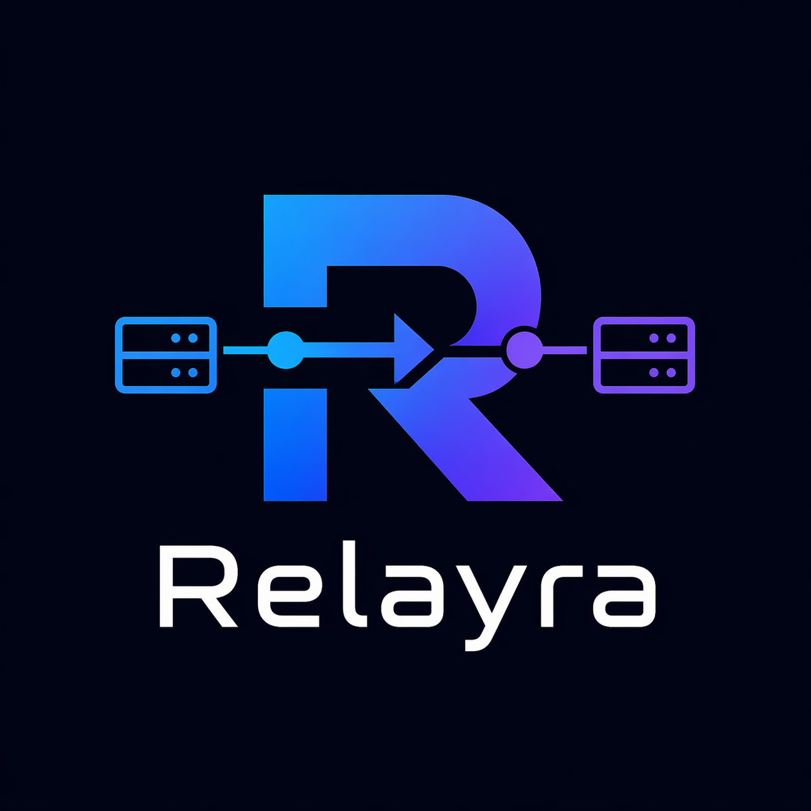
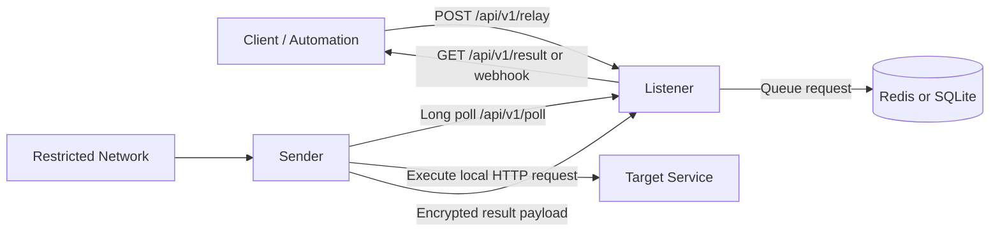

# Relayra

<p align="center">
  
</p>

<p>
  
  
  
  
</p>

Relayra is a self-hosted request relay for environments where the target machine cannot accept inbound traffic.

It connects two roles:

- `listener`: internet-reachable node exposing Relayra APIs
- `sender`: restricted node that polls outbound, executes local requests, and returns results

Relay payloads are encrypted (`AES-256-GCM`), senders can use proxy chains, and operators can work through both CLI and TUI.

## Why Relayra

Use Relayra when you need to:

- reach internal services without opening inbound firewall rules
- move traffic through HTTP/SOCKS proxies from restricted hosts
- run a lightweight bridge instead of full VPN/tunnel stacks
- keep control in your own infrastructure

## Architecture



## Feature Highlights

| Area | What you get |
| --- | --- |
| Pairing | One-time pairing tokens with capability exchange |
| Transport | Polling + long polling, proxy-aware sender connectivity |
| Security | Encrypted poll payloads and optional API token auth |
| Execution | Async relay execution and optional listener-side execution |
| Delivery | Result polling and webhook callbacks with retries |
| Storage | Backend selection: `redis` or `sqlite` |
| Operations | CLI workflows and Bubble Tea TUI for day-to-day use |

## Quick Start

### 1. Build a Linux release bundle

Linux/macOS:

```bash
make dist
```

Windows:

```powershell
cmd /c build.bat
```

### 2. Install on the target machine

```bash
tar xzf relayra-*-linux-amd64.tar.gz
cd relayra-*/
chmod +x install.sh
sudo ./install.sh
```

### 3. Run first-time setup

```bash
relayra
```

The wizard configures role, storage backend, network, logging, and execution policy.

### 4. Pair listener and sender

On listener:

```bash
relayra pair generate --expires 1h
```

On sender:

```bash
relayra proxy add socks5://proxy.example.com:1080   # optional
relayra pair connect <token>
```

### 5. Start runtime

```bash
relayra run
```

Or manage as systemd service:

```bash
relayra service install
relayra service start
relayra service status
```

## API Example

Create relay request:

```bash
curl -X POST http://listener-ip:port/api/v1/relay \
  -H "Content-Type: application/json" \
  -H "Authorization: Bearer <api-token>" \
  -d '{
    "destination_peer_id": "<sender-peer-id>",
    "async": true,
    "request": {
      "url": "http://localhost:8080/api/data",
      "method": "GET"
    }
  }'
```

Fetch result:

```bash
curl http://listener-ip:port/api/v1/result/<request-id> \
  -H "Authorization: Bearer <api-token>"
```

Listener-side execution is supported when enabled (`destination_peer_id`: `listener`, `self`, or listener machine ID).

## Command Cheatsheet

| Goal | Command |
| --- | --- |
| Launch setup wizard / TUI | `relayra` |
| Run service in foreground | `relayra run` |
| Generate pairing token (listener) | `relayra pair generate --expires 1h` |
| Connect sender to listener | `relayra pair connect <token>` |
| Add/list proxies (sender) | `relayra proxy add <url>` / `relayra proxy list` |
| Test long-poll behavior via proxy | `relayra proxy test-longpoll --samples 3 --wait 30` |
| Create API token (listener) | `relayra token create my-app` |
| Manage service | `relayra service [install|start|stop|restart|status|uninstall]` |
| View runtime logs | `relayra logs` |
| Reset all Relayra data | `relayra reset --force` |

## Security and Auth Notes

- Sender requires outbound connectivity only; inbound access is not required.
- Pairing uses one-time token exchange and derives encryption keys for payload transport.
- Poll request/response payloads are encrypted with AES-256-GCM.
- Protected endpoints (`/api/v1/relay`, `/api/v1/result/{id}`, `/api/v1/peers`) enforce Bearer tokens after the first token is created.
- Open endpoints include `/health`, `/api/v1/poll`, `/api/v1/pair`.

## Configuration

Example (`.env`):

```env
RELAYRA_ROLE=listener
RELAYRA_LISTEN_ADDR=0.0.0.0
RELAYRA_LISTEN_PORT=8443
RELAYRA_STORAGE_BACKEND=sqlite
RELAYRA_SQLITE_PATH=/opt/relayra/relayra.db
RELAYRA_LONG_POLLING=true
RELAYRA_ALLOW_LISTENER_EXECUTION=false
```

Full reference: [.env.example](.env.example)

## Development

```bash
make build
make test
make vet
make fmt
```

Project map: [PROJECT_MAP.md](PROJECT_MAP.md)

## Documentation

- Operator guide: [GUIDE.md](GUIDE.md)
- Configuration template: [.env.example](.env.example)
- Architecture map: [PROJECT_MAP.md](PROJECT_MAP.md)

## Status

Relayra is in early public release. Core relay workflows are ready, but validate topology, proxy behavior, and failure scenarios in staging before production rollout.
