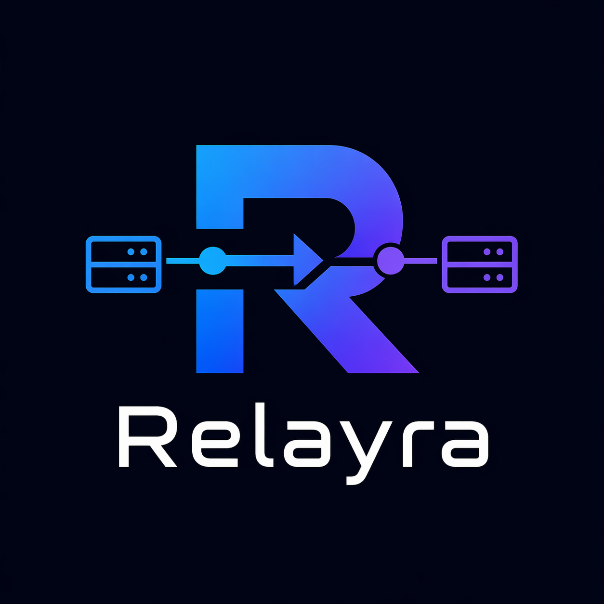
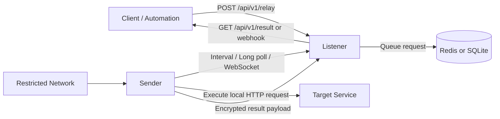

# Relayra

<p align="center">
  
</p>

<p>
  
  
  
  
</p>

Relayra is a self-hosted request relay for environments where the target machine cannot accept inbound traffic.

It connects two roles:

- `listener`: internet-reachable node exposing Relayra APIs
- `sender`: restricted node that polls outbound, executes local requests, and returns results

Relay payloads are encrypted (`AES-256-GCM`), senders can use proxy chains, and operators can work through both CLI and TUI.
Relayra now uses durable lease/ack delivery with request/result ID dedupe so transient proxy outages bias toward re-delivery instead of silent loss.
Large relayed requests can also be chunked across sync cycles so unstable proxies are less likely to drop a single oversized payload.

## Why Relayra

Use Relayra when you need to:

- reach internal services without opening inbound firewall rules
- move traffic through HTTP/SOCKS proxies from restricted hosts
- run a lightweight bridge instead of full VPN/tunnel stacks
- keep control in your own infrastructure

## Architecture


```mermaid
flowchart LR
    C[Client / Automation] -->|POST /api/v1/relay| L[Listener]
    L -->|Queue request| S[(Redis or SQLite)]
    R[Restricted Network] --> D[Sender]
    D -->|Interval / Long poll / WebSocket| L
    D -->|Execute local HTTP request| T[Target Service]
    D -->|Encrypted result payload| L
    L -->|GET /api/v1/result or webhook| C
```

## Feature Highlights

| Area | What you get |
| --- | --- |
| Pairing | One-time pairing tokens with capability exchange |
| Transport | Interval polling, long polling, or true-push WebSocket with replay/resume and optional long-poll fallback |
| Reliability | WebSocket proxy reliability testing, chunked request transport, queue clearing, reconnect-aware retries, and durable message replay |
| Security | Encrypted poll payloads and optional API token auth |
| Execution | Async relay execution and optional listener-side execution |
| Delivery | Durable leased delivery, reconnect reconciliation, result polling, and webhook callbacks |
| Storage | Backend selection: `redis` or `sqlite` |
| Operations | CLI workflows and Bubble Tea TUI for day-to-day use |

## Quick Start

### 1. Build a Linux release bundle

Linux/macOS:

```bash
make dist
```

Windows:

```powershell
cmd /c build.bat
```

### 2. Install on the target machine

```bash
tar xzf relayra-*-linux-amd64.tar.gz
cd relayra-*/
chmod +x install.sh
sudo ./install.sh
```

### 3. Run first-time setup

```bash
relayra
```

The wizard configures role, storage backend, network, sender transport mode, proxy cooldown, logging, and execution policy.

### 4. Pair listener and sender

On listener:

```bash
relayra pair generate --expires 1h
```

On sender:

```bash
relayra proxy add socks5://proxy.example.com:1080   # optional
relayra pair connect <token>
```

### 5. Start runtime

```bash
relayra run
```

Or manage as systemd service:

```bash
relayra service install
relayra service start
relayra service status
```

Upgrade an existing node in-place without re-running setup:

```bash
sudo ./upgrade.sh
```

## Upgrade Note

This release changes the sender/listener delivery state model.
Upgrade during a drained maintenance window: let queued work finish before deploying the new version.

The release bundle now also includes `upgrade.sh`, which preserves `/opt/relayra/.env`, backs up `/opt/relayra/relayra.db` when present, swaps the binary in place, and restarts the systemd service if it was already running.

## API Example

Create relay request:

```bash
curl -X POST http://listener-ip:port/api/v1/relay \
  -H "Content-Type: application/json" \
  -H "Authorization: Bearer <api-token>" \
  -d '{
    "destination_peer_id": "<sender-peer-id>",
    "async": true,
    "request": {
      "url": "http://localhost:8080/api/data",
      "method": "GET"
    }
  }'
```

Fetch result:

```bash
curl http://listener-ip:port/api/v1/result/<request-id> \
  -H "Authorization: Bearer <api-token>"
```

Listener-side execution is supported when enabled (`destination_peer_id`: `listener`, `self`, or listener machine ID).

## Command Cheatsheet

| Goal | Command |
| --- | --- |
| Launch setup wizard / TUI | `relayra` |
| Run service in foreground | `relayra run` |
| Generate pairing token (listener) | `relayra pair generate --expires 1h` |
| Connect sender to listener | `relayra pair connect <token>` |
| Add/list proxies (sender) | `relayra proxy add <url>` / `relayra proxy list` |
| Test long-poll behavior via proxy | `relayra proxy test-longpoll --samples 3 --wait 30` |
| Test websocket reliability via proxy | `relayra proxy test-websocket --samples 3 --hold 30 --interval 5` |
| Create API token (listener) | `relayra token create my-app` |
| Manage service | `relayra service <command>` |
|  | `install`, `start`, `stop`, `restart`, `status`, `uninstall` |
| View runtime logs | `relayra logs` |
| Reset all Relayra data | `relayra reset --force` |

## Security and Auth Notes

- Sender requires outbound connectivity only; inbound access is not required.
- Pairing uses one-time token exchange and derives encryption keys for payload transport.
- Poll payloads and websocket request/response frames are encrypted with AES-256-GCM.
- WebSocket mode now uses configurable ping, keepalive, idle, write-timeout, reconnect, fallback, and Redis pool sizing settings.
- The sender can measure websocket reliability against the paired listener by sending encrypted probe traffic through each configured proxy.
- Protected endpoints (`/api/v1/relay`, `/api/v1/result/{id}`, `/api/v1/peers`) enforce Bearer tokens after the first token is created.
- Open endpoints include `/health`, `/api/v1/poll`, `/api/v1/ws`, `/api/v1/pair`.

## Configuration

Example (`.env`):

```env
RELAYRA_ROLE=listener
RELAYRA_LISTEN_ADDR=0.0.0.0
RELAYRA_LISTEN_PORT=8443
RELAYRA_STORAGE_BACKEND=sqlite
RELAYRA_SQLITE_PATH=/opt/relayra/relayra.db
RELAYRA_REDIS_POOL_SIZE=64
RELAYRA_TRANSPORT_MODE=websocket
RELAYRA_LONG_POLL_WAIT=30
RELAYRA_TRANSPORT_CHUNK_SIZE_BYTES=262144
RELAYRA_WS_PING_INTERVAL=20
RELAYRA_WS_KEEPALIVE_INTERVAL=5
RELAYRA_WS_WRITE_TIMEOUT=15
RELAYRA_WS_IDLE_TIMEOUT=60
RELAYRA_WS_RECONNECT_BASE_SECONDS=1
RELAYRA_WS_RECONNECT_MAX_SECONDS=30
RELAYRA_WS_ENABLE_LONGPOLL_FALLBACK=true
RELAYRA_PROXY_COOLDOWN_SECONDS=300
RELAYRA_ALLOW_LISTENER_EXECUTION=false
```

Full reference: [.env.example](.env.example)

## WebSocket Reliability Testing

On a sender with a paired listener and configured proxies:

```bash
relayra proxy test-websocket
relayra proxy test-websocket --samples 3 --hold 30 --interval 5
```

Relayra opens a websocket to the paired listener through each configured proxy, completes the live websocket handshake, exchanges protocol-level keepalive probes, and reports a per-proxy reliability score based on connection uptime plus delivered probe acknowledgements.

In normal websocket runtime mode, Relayra now uses the websocket as a true duplex push channel. The listener can push requests immediately, the sender can push state/results immediately, and both sides keep the session alive with small protocol keepalives plus reconnect/resume cursors.

If `RELAYRA_WS_ENABLE_LONGPOLL_FALLBACK=false`, websocket mode reconnects directly instead of falling back to HTTP long-poll. Relayra keeps this reconnect loop single-threaded so only one active control connection exists at a time.

The sender proxy detail screen also includes a `Test WebSocket Reliability` action for the currently selected proxy.

## Large Request Chunking

- Small relay requests still travel in a single encrypted poll payload.
- Oversized relay requests are split into smaller transport chunks and reassembled on the sender before execution.
- Chunk progress is durable, duplicate-safe, and reconnect-aware.

## Listener Peer Queue Management

On the listener peer detail screen, each sender peer now includes a `Clear Queue` action that removes queued-only requests for that peer without cancelling already leased/in-flight work.

## Dashboard Version

The TUI Status Dashboard now shows the running Relayra version so operators can verify upgraded listener/sender pairs at a glance during rollout and troubleshooting.

## Development

```bash
make build
make test
make vet
make fmt
```

Project map: [PROJECT_MAP.md](PROJECT_MAP.md)

## Documentation

- Operator guide: [GUIDE.md](GUIDE.md)
- Configuration template: [.env.example](.env.example)
- Architecture map: [PROJECT_MAP.md](PROJECT_MAP.md)

## Status

Relayra is in early public release. Core relay workflows are ready, but validate topology, proxy behavior, and failure scenarios in staging before production rollout.
